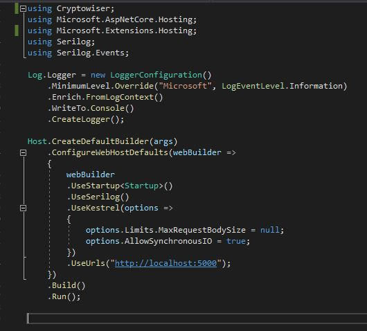
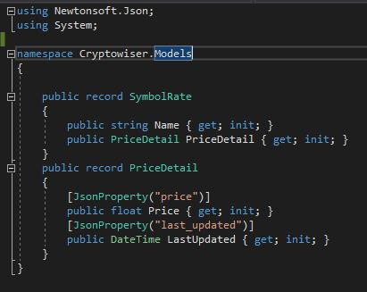
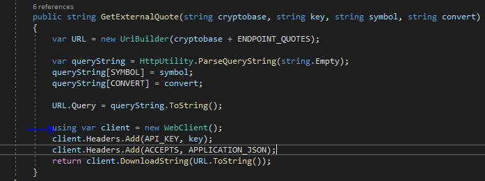

# Answers to technical questions


## 1. 
**Question** - How long did you spend on the coding assignment? What would you add to your solution if you had
more time? If you didn't spend much time on the coding assignment then use this as an opportunity to
explain what you would add. 

**Pravin** - I spend 2 hours on weekdays and about 6 hours on weekends, so close to 20-22 hours in total on this.

I categories things on MoSCoW and focused on 'must do' at first so I think I have done MVP.
If I had more time I would still improve solution quite alot.

I would 

  - Integration Tests - I really wanted to add end to end test for sandbox api, I started but couldn't finish in it.
  - Add Graphql on backend API - I like graphql querying.
  - I would disconnect user requests directly calling external source for rates.
  Instead I would create backgroud process to poll external sources for rates 
  and then store exchange rates in internal cache and update them periodically.
  This is what I thought of adding initially but didn't do in first iteration.
  - Instead of hardcoding default currencies to show rates, I would get them from User or allow them to be editable on UI.
  Although I have made sure I have an extra endpoint on API which can accept 'currencies to show rates' in.
  - I would add commit pre-hook for ensuring code quality
  - On fronend, I would add tests and code linting for better code standards.
  Also, I really want to structure code properly on fronend.
  At the momemnt, I am logging errors and responses in console.log, 
  I would like to change that too.
  - I would excrypt connection strings, secrets and move them to vault.


## 2. 
**Question** - What was the most useful feature that was added to the latest version of your language of choice?
Please include a snippet of code that shows how you've used it.

**Pravin** - C# is my language of choice, I have been working on it for 9 years and still think there is so much to learn and improve in it, 
because it is feature rich, has good community support and is updated frequently.

C# 9 has added

#### Top-level statements 
Top-level statements remove unnecessary ceremony from many applications. 
I have demonstrated this in program.cs



#### Record types and Init only setters
C# 9.0 introduces record types. You use the record keyword to define a reference type that provides built-in functionality for encapsulating data.
Init only setters provide consistent syntax to initialize members of an object.



C# 8 has added

#### Using declarations
A using declaration is a variable declaration preceded by the using keyword. It tells the compiler that the variable being declared should be disposed at the end of the enclosing scope.



#### Fit and finish features
Many of the other features help you write code more efficiently. In C# 9.0, you can omit the type in a new expression when the created object's type is already known. The most common use is in field declarations


## 3. 
**Question** - How would you track down a performance issue in production? Have you ever had to do this?

**Pravin** - Yes, this has happened in few instances to us and I helped investigate and resolve them.

First thing for me is to find impact and urgencies, what the area they imapacting, whats the user group, is it specific to some region or some part of application,
so it's easier to track them down.

Once I know that I try 

    - To know when they exists, like sequence of events or specific time of day.
    - Have sufficient details to figure out what's going wrong when performance issue kicks in.

The key for both of those is logging. The ideal is to have logging with optional logging levels that will spit out more detail which can be selectively turned on.
(for eg. LogLevel in appsettings for dotnet apps)
    
Apart from that I try to replicate same environment in non-prod and step through logs.

The last production issue we solved was related to excel add-in on user machines.
Users reported excel add-ins are slow to load data in production.
Which investigated and turned out to be http timeouts on prod on some instances because production firewall blocking external calls.

The other performance issue I investigate and fixed is long due improvements of badly written stored procedure which returned data for trade security report. 
This report is required by user to run daily. It was usually overrunning at 40-60 mins and sometimes timed out in sql.

I created tactical solution.
Re-wrote sql in parts. which used to gather and join the data.
I wrapped stored procedure calls in multiple microservices.
Further added graphql at top so that user can only request fields he wanted to see at a time, which avoids bringing in unnecessary data and increase in run length.

Report run length has improved from 40 mins to 30 seconds.

## 4. 
**Question** - What was the latest technical book you have read or tech conference you have been to? What did you
learn?

**Pravin** - I don't read books. But I like to watch videos related to technology mostly because you see what you needed to see and also can try hands-on.

I have pluralsight subscription so I try spend some time weekly to learn something useful.
https://app.pluralsight.com/profile/pravin-deshmukh-7d

Apart from that, I like to attend dotnet conference which is streamed live on YT

Last I atteneded they talking about dotnet template https://github.com/Dotnet-Boxed/Templates
Which is very interesting to me because it can help me get projects templated and get started quickly on boilerplate code.

I Also managed to ask question 'how to include auto code metrics within template' but it was all git action specific.
funny enough, it didn't worked in live when they tried demonstrating. (https://www.youtube.com/watch?v=A93Fn_qMLX4 skip to 46:00)

But I worked it out later in POC.

## 5. 
**Question** -  What do you think about this technical assessment?

**Pravin** - Assignment is good and got me thinking on multiple things.


## 6. 
**Question** - . Please, describe yourself using JSON.

```
[
 {
   "name": "Pravin",
   "lastname": "Deshmukh",
   "about": "I'm a software engineer with special interests in middleware and backend development for complex scalable applications. I also create frontends but mostly I like to write programs which solves problems. ",
   "website": {
	"personal": "https://thepravindeshmukh.in",
	"linkedin": "https://www.linkedin.com/in/thepravindeshmukh/"
   },
   "expertise": {
		"Applications Development": {
			"Description": "I have about 9 years of experience designing, implementing, leading and launching software products."
		},
		"Databases": {
			"Description": "I also have special interests in database technologies. I have expertise and experience working in SQL."
		},
		"Dev Ops": {
			"Description": "I work in cross functional team where I work across the entire application lifecycle, from development and test to deployment to operations."
		}
	},
   "skills": 
		{
			"C#":  {
          "ExperienceInYears": "9"
      },
			".NET CORE":  {
          "ExperienceInYears": "9"
      },
			"Microservices":  {
          "ExperienceInYears": "5"
      },
			"Scrum And Agile":  {
          "ExperienceInYears": "5"
      },
			"JavaScript":  {
          "ExperienceInYears": "1"
      },
			"Docker":  {
          "ExperienceInYears": "1"
      },
			"Jenkins-Ansible":  {
          "ExperienceInYears": "2"
      }
    }
 }
]
```
